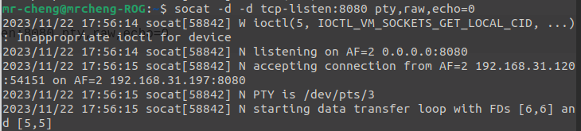
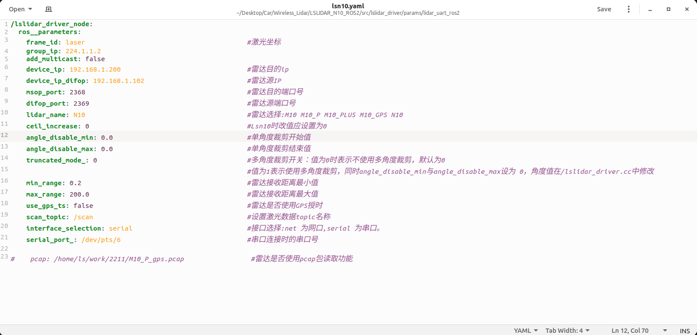
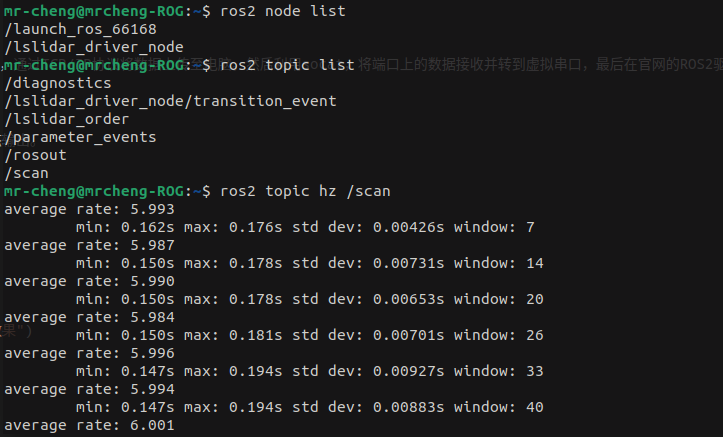
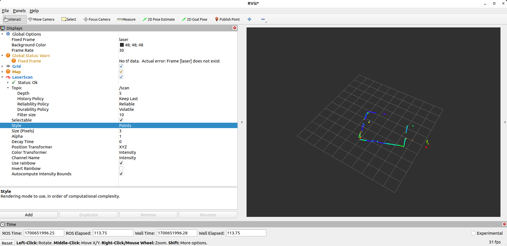

# 无线激光雷达

## 一、硬件环境

&emsp;&emsp;1、ESP32S3-N16R8

&emsp;&emsp;2、镭神N10激光雷达

&emsp;&emsp;3、小米路由器

## 二、使用方法

&emsp;&emsp;驱动依托于官网的ROS2驱动，利用ESP32S3进行数据采集，通过TCP/IP协议将数据上传至电脑。然后利用socat，将端口上的数据接收并转到虚拟串口，最后在官网的ROS2驱动下更改对应串口号为虚拟串口号即可。

## 三、详细步骤
    
&emsp;&emsp;1、连接ESP32S3到电脑，同时可以打开串口助手查看状态输出。

&emsp;&emsp;2、打开新的命令行页面,输入如下命令：

    socat -d -d udp-listen:8080 pty,raw,echo=0

&emsp;&emsp;Effects screenshot:

注意，这里需要记住映射的是/dev/pty/3，需要在后续雷达启动包中将对应的参数更改为对应的串口。

&emsp;&emsp;3、修改参数配置文件。

    gedit ../Wireless_Lidar/LSLIDAR_N10_ROS2/src/lslidar_driver/params/lidar_uart_ros2/lsn10.yaml

修改上述文件中serial_port_为步骤2中实际打开的虚拟串口编号。然后重新编译lslidar_driver。

&emsp;&emsp;4、打开新的命令行页面，运行镭神N10的ROS2包

    ros2 launch lslidar_driver lsn10_launch.py

&emsp;&emsp;Effects screenshot:

&emsp;&emsp;5、查看话题、频率以及rviz2查看点云效果

    ros2 node list
    ros2 topic list
    ros2 topic hz /scan
    rviz2

&emsp;&emsp;Effects screenshot:

&emsp;&emsp;其中，雷达的扫描频率被设置为6Hz。极限可以到12Hz，未测试。

## 四、后记

&emsp;&emsp;由于对ESP32S3不熟悉，浪费了些时间。对于其他需求的激光雷达可以更改ESP驱动里面的包长度和Rx回调时间。后续可能会增加cppTcp转Serial的驱动。对于延迟问题，在本地测试的效果应该在几ms以内。由于这个取决于测试环境，故不列举出数据，具体可以在代码里面测试。

# Wireless Lidar

## I. Hardware Environment

&emsp;&emsp;1、ESP32S3-N16R8

&emsp;&emsp;2、leishen N10 lidar

&emsp;&emsp;3、Xiaomi Router

## II. Usage

&emsp;&emsp; The driver relies on the ROS2 driver from the official website and uses ESP32S3 for data collection. The data is uploaded to the computer via TCP/IP protocol. Then, using socat, the data on the port is received and transferred to the virtual serial port. Finally, the corresponding serial port number is changed to the virtual serial port number under the official ROS2 driver.

## III. Detailed Steps
    
&emsp;&emsp;1. Connect ESP32S3 to the computer and open a serial assistant to view the status output.

&emsp;&emsp;2. Open a new command line window and enter the following command:

    socat -d -d tcp-listen:8080 pty,raw,echo=0

&emsp;&emsp;Effects screenshot:

&emsp;&emsp;3、lslidar driver running screenshot

    ros2 launch lslidar_driver lsn10_launch.py

&emsp;&emsp;Effects screenshot:

&emsp;&emsp;4.View the topic, frequency, and point cloud in rviz2:

    ros2 node list
    ros2 topic list
    ros2 topic hz /scan
    rviz2

&emsp;&emsp;Effects screenshot:

&emsp;&emsp;The scanning frequency of the LiDAR is set to 6Hz, and the maximum frequency can reach 12Hz, which has not been tested.

## IV. Postscript

&emsp;&emsp;Because unfamiliar with ESP32S3, it took some time to configure. For other LiDAR requirements, the packet length and Rx callback time in the ESP driver can be changed. A cppTcp-to-Serial driver may be added in the future. As for delay issues, the local test showed a delay of a few milliseconds, which depends on the testing environment and is not listed in the text. You can test it in the code.